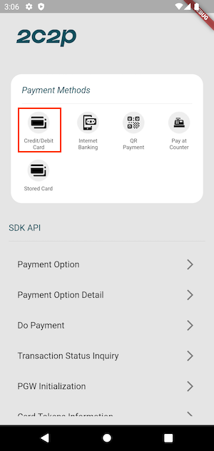
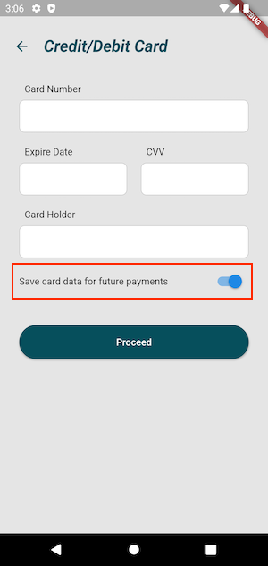

# Stored Card Feature Example

Tokenization or stored card feature is a method to replace sensitive data such as credit card details with non-sensitive data. Whenever the card is stored, 2C2P will return the card token to merchant.

With 2C2P's Tokenization feature, merchants do not need to undertake a complex and time-consuming PCI-DSS certification process. All the sensitive information is protected at 2C2P with the most advanced security that is compliant with PCI-DSS standards.

This package provides payment features from the native 2c2p PGW SDK. Check out the example app for its current features as more functions will be implemented in the future.

## Setup
Before making a transaction, the merchant must provide some information to the example app. Please find the `ConstantRepository` class and set the following fields from your merchant portal:
- MERCHANT_ID
- SECRET_KEY
- CURRENCY_CODE - This field can change depending on the desired currency code.

### Pay with card token (Stored Card)

Follow these instructions using the example app to pay with a card token.

1. Run the example app from example project, then press the `Credit/Debit Card` menu option. \

2. Input card number and other info then check `Save card data for future payments`. \
   

3. Press `Proceed` to proceed the transaction.
4. After a successful transaction, the app will return to the home page.
5. These next steps will use the previous card to perform a new payment transaction.
6. Press `Stored Card` to perform a new transaction. \
   

7. The app will show new transaction without needing to input a card number. \
   

## Handle Response

See [this](HANDLE_RESPONSE.md)
